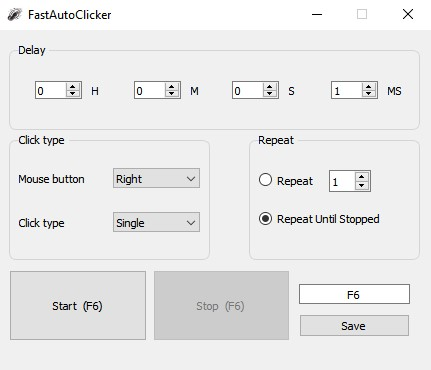

# FastAutoClicker

## Features

- Configurable click rate and interval.
- Simple and intuitive user interface.
- Lightweight and easy to use.

## Download

Download the latest version from the [releases](https://github.com/AliAlWahayb/FastAutoClicker/releases).

## Contributing

Contributions are welcome! If you have any suggestions, bug reports, or feature requests, please open an issue or submit a pull request.

## License

This project is licensed under the MIT License.

## Disclaimer

Please note that the use of this program in any game or application should comply with the terms and conditions of that game or application. Make sure to respect the rules and guidelines set by the respective game developers and community.
## Acknowledgements

We would like to thank the developers of the libraries and resources used in this project for their valuable contributions.
## 

If you have any questions or need further assistance, feel free to contact us at [alialwahayb@outlook.com].
